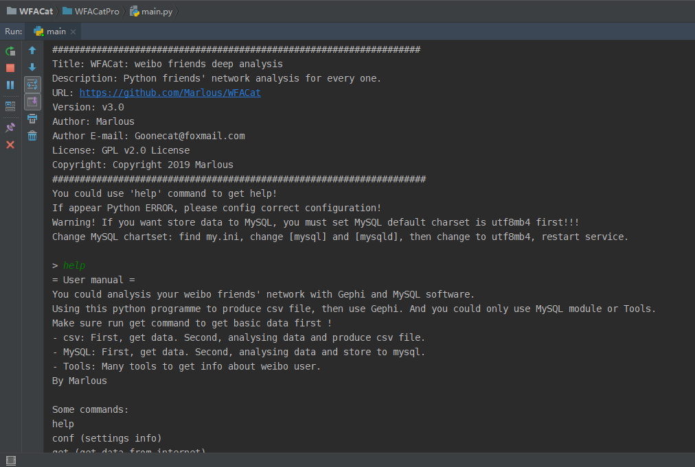
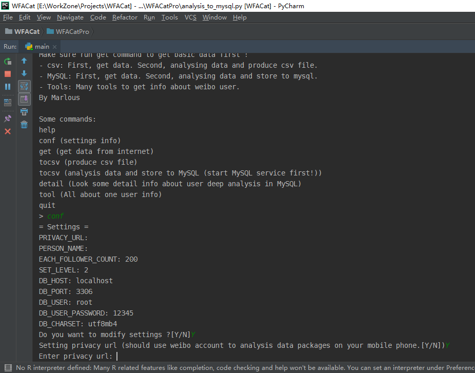
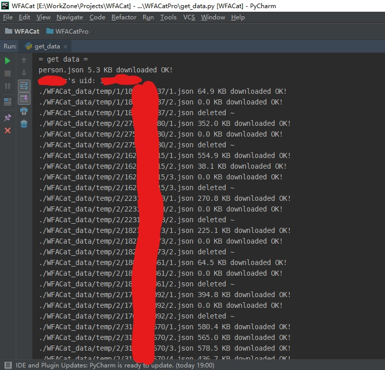
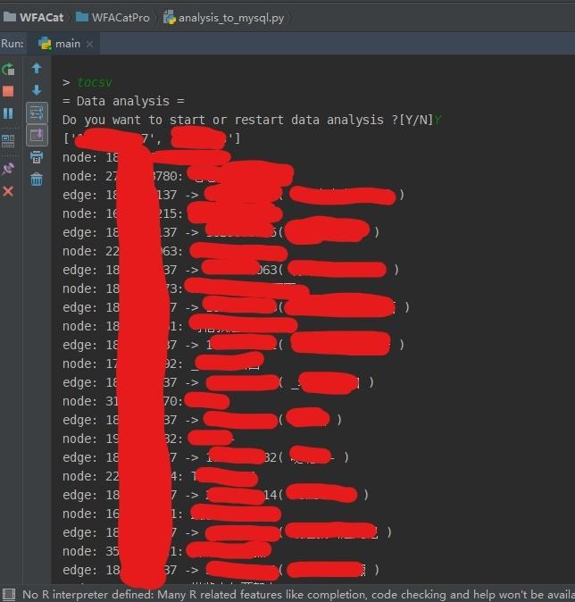
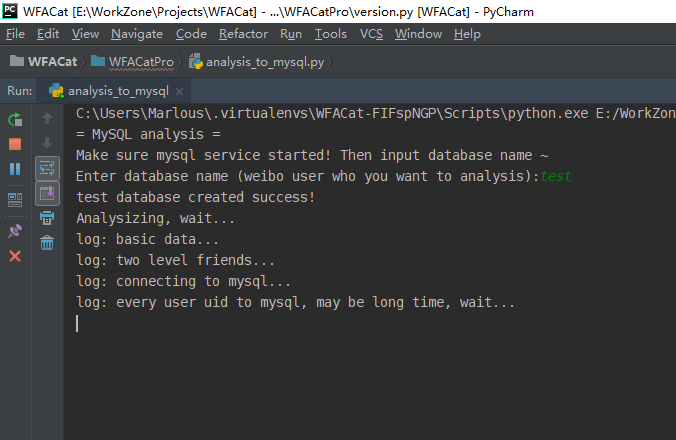
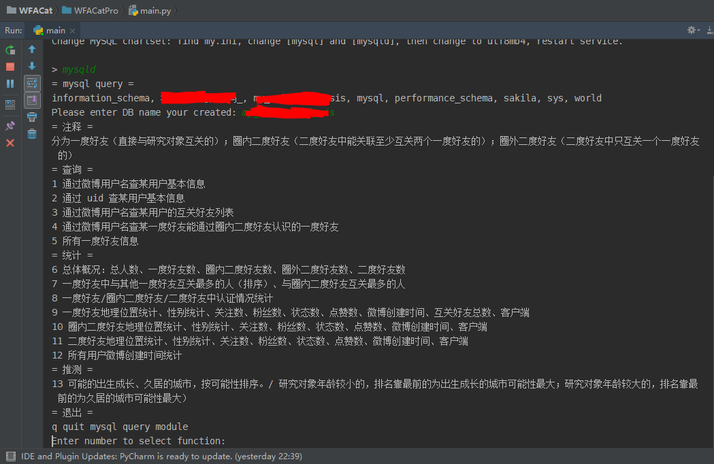
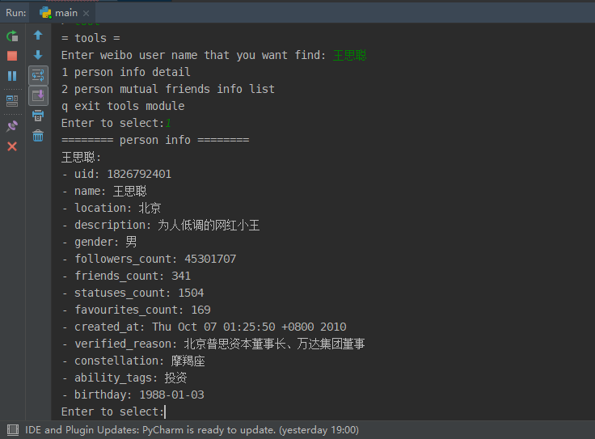
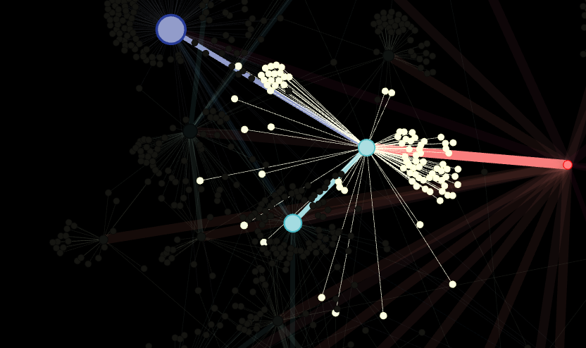

# WFACat
## Introduction - 介绍
Weibo friends' net Deep analysis 微博用户好友人际关系网络深度分析（人脉深度为二）  

### Summary - 概要
- 你只需一个账号的授权链接、输入所要研究的对象。

- 即可得到 a）此研究对象的二度人脉 node.csv、edge.csv 文件供数据可视化软件 Gephi 使用。b）数据分析后写入数据库，可以得到更多详细信息，详见 “特性”。c）使用 Tableau 进行详细的数据统计可视化分析。

- 软件产生的数据在 WFACat_data 文件夹下。

### Feature - 特性
1. 查询：
- 通过微博用户名查某用户基本信息

- 通过 uid 查某用户基本信息

- 通过微博用户名查某用户的互关好友列表及其好友信息

- 通过微博用户名查某一度好友能通过圈内二度好友认识的一度好友

- 所有一度好友信息

2. 统计：
- 总体概况：总人数、一度好友数、圈内二度好友数、二度好友数

- 一度好友中与其他一度好友互关最多的人（排序）、与圈内二度好友互关最多的人

- 一度好友 / 圈内二度好友 / 二度好友中认证情况统计

- 一度好友地理位置统计、性别统计、关注数、粉丝数、状态数、点赞数、微博创建时间、互关好友总数、客户端

- 圈内二度好友地理位置统计、性别统计、关注数、粉丝数、状态数、点赞数、微博创建时间、客户端

- 二度好友地理位置统计、性别统计、关注数、粉丝数、状态数、点赞数、微博创建时间、客户端

3. 推测：
- 根据统计的结果做出一些有趣的推测（如统计手机客户端型号等）。

## Requirements - 必要条件
- OS：Windows 10  
- IDE：PyCharm
- Python 3.7（64 bit）

## Usage - 用法
1. 克隆此仓库使用 IDE 运行，或直接使用 Release 文件夹中打包好的程序。

2. 使用流程：
- 使用 `help` 命令查看帮助；
- 使用 `conf` 命令进行配置；
- 使用 `get` 命令获得基本数据；
- 使用 `tocsv` 命令生成需要的文件，供 Gephi 软件数据可视化人际关系网络；
- 使用 `tomysql`  命令将获得的基本数据存入 MySQL；
- 使用 `mysqld` 命令查看深度分析的各种结果信息；
- 使用 `tool` 命令实时查询单个用户信息；
- 使用 `datac` 命令将获得的基本数据做一些清理，供 Tableau 软件数据统计可视化。

3. 软件使用效果截图：
- 主界面、help：  

- 配置界面：  

- 获得基本的数据：  

- 数据存储到 csv 文件、MySQL 数据库：  

- 查看深度分析的各种结果信息：  

- 实时查询单个用户信息：  

4. 使用 Gephi 进行数据可视化分析：  
[使用方法参考我的博文：《用爬虫和 Gephi 研究微博好友二度人脉分析》](https://marlous.github.io/2019/04/06/%E7%94%A8%E7%88%AC%E8%99%AB%E5%92%8C-Gephi-%E7%A0%94%E7%A9%B6%E5%BE%AE%E5%8D%9A%E5%A5%BD%E5%8F%8B%E4%BA%8C%E5%BA%A6%E4%BA%BA%E8%84%89%E5%88%86%E6%9E%90/)  

5. 使用 Tableau 进行数据统计可视化分析：  
使用 Tableau 直接链接创建的数据库即可，然后分析。（截图暂略）

## Support - 支持
### Contact - 联系
- By Marlous
- E-mail：Goonecat@foxmail.com

## License - 版权信息
WFACat is released under the GPL license. See [LICENSE](https://github.com/Marlous/WFACat/blob/master/LICENSE) for additional details.